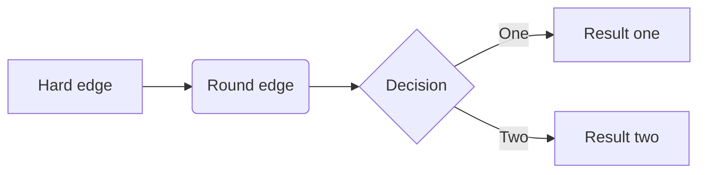

##  配置环境，建立Git与GitHub之间的连接

##### 1. 使用以下命令，设置用户名和邮箱

```java
git config --global user.name 'MingduDing'
git config --global user.email 'dingmingdugithub@163.com'
```

---------------------**使用以下命令，查看设置的用户名和邮箱**--------------------------

```c++
git config user.name
git config user.email
```

##### 2. 生成SSH公钥

```c++
ssh-keygen -t rsa -C 'dingmingdugithub@163.com'。连续回车
```

##### 3. GitHub配置SSH公钥

 	在第2步中输出的路径里面，用记事本打开`id rsa.pub`文件，全选复制。回到`GitHub`，点击头像，选择`settings`，选择右边的`SSH and GPSKeys`，随便填写，把复制的公钥粘贴在`key`里，点击`Add SSK key`完成。

## 用Git向GitHub上传项目

##### 1. 在GitHub上创建New repository

​	`"Initialize this repository with a README"` # 最好不要勾选，后面手动创建

##### 2. 找到想要上传的项目文件夹，鼠标右键，选择`Git Bash Here`，弹出命令窗口。（必须是文件夹）

##### 3. 初始化仓库

```c++
git init
touch README.md
git add. # 整个文件夹 / git add my_file.txt # 某一个文件
git commit -m 'first_commit' # 引号内容是备注，可以修改
git remote add origin git@github.com:MingduDing/New_file.git
git push -u origin master # 仓库为空，首次推送，加上`-u`参数
```

## 使用Git重新上传修改后的文件

##### 1. 进入修改后的文件夹

右键，选择`Git Bash Here`。

##### 2. `git add file`

##### 3. `git commit -m 'update'`

##### 4. `git push -u origin master`

## 从远程库克隆

要克隆一个仓库，首先必须知道仓库的地址，然后使用`git clone`命令克隆。

Git支持多种协议，包括`https`，但通过`ssh`支持的原生`git`协议速度最快。

```python
git clone git@github.com:MingduDing/库名.git
    				或
git clone https://github.com/MingduDing/库名.git
```

## 一些删除等小问题

 `git rm --cached file`

- *没有上传之前修改*：**索引库和本地仓库是两个库**，文件先`git add file`进索引库，发生修改之后，重新`add`即可。
- *完成上传之后修改*：**需要两步**，重新`git add file`添加文件至索引库，然后`git commit -m '说明'`上传至本地仓库。
- *向库里增添文件*：先`add`，然后`commit`，最后`push`。
- *我的上传问题*：`git pull --rebase origin master`，或`git pull origin master`再`push`。
- *origin问题*：`git remote rm origin`。
- *pull问题*：`git pull origin master --allow-unrelated-histories`。

## 创建与合并分支

Git鼓励大量使用分支：

查看分支：`git branch`

创建分支：`git branch <name>`

切换分支：`git checkout <name>`

创建+切换分支：`git checkout -b <name>`

合并某分支到当前分支：`git merge <name>`

删除分支：`git branch -d <name>`

| 指令              | 说明                   |
| ----------------- | ---------------------- |
| git status 文件名 | 查看仓库当前状态       |
| git diff 文件名   | 查看文件修改内容       |
| git log           | 显示从最近到最远的日志 |

**场景1：**当你改乱了工作区某个文件的内容，想直接丢弃工作区的修改时，用命令`git checkout -- file`。

**场景2：**当你不但改乱了工作区某个文件的内容，还添加到了暂存区时，想丢弃修改，分两步，第一步用命令`git reset HEAD <file>`，就回到了场景1，第二步按场景1操作。

**场景3：** 已经提交了不合适的修改到版本库时，想要撤销本次提交，前提是没有推送到远程库。

- `HEAD`指向的版本就是当前版本，因此，Git允许我们在版本的历史之间穿梭，使用命令`git reset --hard commit_id`。
- 穿梭前，用`git log`可以查看提交历史，以便确定要回退到哪个版本。
- 要重返未来，用`git reflog`查看命令历史，以便确定要回到未来的哪个版本。


## 基本语法

#### 生成目录

输入`[toc]`，然后输入回车，就可以自动生成目录列表（table of content）了。

#### 列表

##### 有序列表

在列表前加上数学序号（数字序号和列表内容之间要有一个空格），即可生成有序列表，比如下面代码的生成样式见代码块下的形式

```
1. 苹果
2. 西瓜
```

1. 苹果
2. 西瓜

##### 无序列表

可以在列表内容前加上`+`、`*`、`-`等（符号和列表内容之间要有一个空格），即可生成无序列表，如：

```
+ 苹果
+ 西瓜
```

#### 表格

可以使用`Ctrl+T`快捷键来插入表格，按下快捷键之后就会出现一个表格设置，预先设定行数和列数，然后就出现表格了。用户可以直接像在office上编辑表格内容那样对表格进行编辑，并通过每列上的按钮来设置该列的内容的对齐方式（提供向左、居中、向右对齐）。

如果你想增加或删减行数和列数，可以直接通过表格左上角的按钮改变表格的行数和列数。

#### 图片

对于本地图片，我们可以直接拖进来，Typora会自动识别图片并帮我们生成图片的地址。

#### URL链接

使用尖括号<>可以插入url链接的内容，实现自动链接，如：www.baidu.com。
如果不想把链接地址显示出来，只是对链接地址进行说明的话，可以通过[链接说明](链接地址)来实现，例如:[百度一下](www.baidu.com) ，其效果为百度一下。

#### 数学符号

一些数学符号可以参见Latex数学符号表。

## 几个有用的特性
#### 代码块样式（code block）
Typora中的代码块可以设置不同的语言，从而代码块的内容根据不同的语言显示对应的格式。

Typora中还可以提供了不同的样式（theme）供用户选择，内置的样式有五种，当然CodeMirror还提供了一些其他的样式，用户可根据自己的爱好选择不同样式。修改样式的具体方法为：（以Sublime Text的Monokai样式为例）

1. 把样式表的内容复制粘贴到主题目录themes下的base.css或[theme].css样式表文件内，其中[theme]表示对应的主题的名字，我使用的主题是Monokai，所以我修改的是Monokai.css文件。粘贴进去之后把.cm-s-monokai统一改成.cm-s-inner。

2. 在新增样式的底部，添加代码块的基础样式到样式表中，如font-family、color和background等属性，完成后的样式表内容应该是类似这样的:

```c++
/* Based on Sublime Text's Monokai theme */
.cm-s-inner.CodeMirror { background: #272822; color: #f8f8f2; }
.cm-s-inner div.CodeMirror-selected { background: #49483E; }
.cm-s-inner .CodeMirror-line::selection, .cm-s-inner .CodeMirror-line > span::selection, .cm-s-inner .CodeMirror-line > span > span::selection { background: rgba(73, 72, 62, .99); }
.cm-s-inner .CodeMirror-line::-moz-selection, .cm-s-inner .CodeMirror-line > span::-moz-selection, .cm-s-inner .CodeMirror-line > span > span::-moz-selection { background: rgba(73, 72, 62, .99); }
.cm-s-inner .CodeMirror-gutters { background: #272822; border-right: 0px; }
.cm-s-inner .CodeMirror-guttermarker { color: white; }
.cm-s-inner .CodeMirror-guttermarker-subtle { color: #d0d0d0; }
.cm-s-inner .CodeMirror-linenumber { color: #d0d0d0; }
.cm-s-inner .CodeMirror-cursor { border-left: 1px solid #f8f8f0; }

.cm-s-inner span.cm-comment { color: #75715e; }
.cm-s-inner span.cm-atom { color: #ae81ff; }
.cm-s-inner span.cm-number { color: #ae81ff; }

.cm-s-inner span.cm-property, .cm-s-inner span.cm-attribute { color: #a6e22e; }
.cm-s-inner span.cm-keyword { color: #f92672; }
.cm-s-inner span.cm-builtin { color: #66d9ef; }
.cm-s-inner span.cm-string { color: #e6db74; }

.cm-s-inner span.cm-variable { color: #f8f8f2; }
.cm-s-inner span.cm-variable-2 { color: #9effff; }
.cm-s-inner span.cm-variable-3, .cm-s-inner span.cm-type { color: #66d9ef; }
.cm-s-inner span.cm-def { color: #fd971f; }
.cm-s-inner span.cm-bracket { color: #f8f8f2; }
.cm-s-inner span.cm-tag { color: #f92672; }
.cm-s-inner span.cm-header { color: #ae81ff; }
.cm-s-inner span.cm-link { color: #ae81ff; }
.cm-s-inner span.cm-error { background: #f92672; color: #f8f8f0; }

.cm-s-inner .CodeMirror-activeline-background { background: #373831; }
.cm-s-inner .CodeMirror-matchingbracket {
  text-decoration: underline;
  color: white !important;
}

/**apply to code fences with plan text**/
.md-fences {
  background-color: #272822;
  color: #f8f8f2;
  border: none;
}
.md-fences .code-tooltip {
  background-color: #272822;
}
```

#### 绘制图表
Typora支持在编辑器中直接绘制一些简单的图表，比如流程图等，这样就使我们无须直接从其他地方复制一张图片过来，但是要修改图中的内容时，需要去其他地方修改，再复制粘贴图。

举一个官方提供的例子：

比如代码为：



#### 其他特性
除了以上提到的，可以通过File->Preferences来设置一些特性。例如：

代码块显示行号：在Code Fences这一项中勾选“Display line number”即可。
关键词高亮：在Syntex Support勾选“Highlight”这一项即可。然后就可以通过在==中插入需要关键词来实现，如: 关键词==

#### 文件转换
markdown和word的转换
使用工具：typora+pandoc

1、下载并安装pandoc

 pandoc的下载地址：https://github.com/jgm/pandoc/releases/tag/2.0.5

 （注意，Windows选择pandoc-**-windows.msi这个版本即可）

2、重启typora

3、打开要转换格式的文件，选择“File”–>Export–> Word(.docx) 即可。

​	而如果要从word转换为markdown，则用下面方法即可：

​	ctrl+c复制word文本，打开typora，ctrl+v粘贴。
